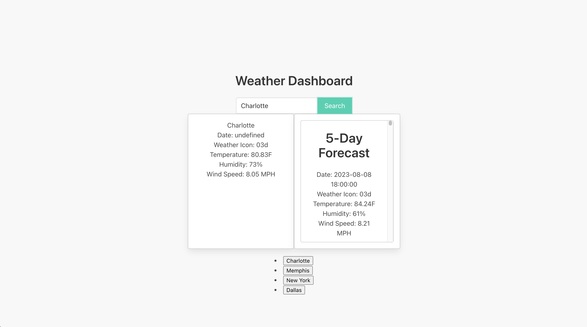

# Challenge 6: Weather Dashboard

## Description

This is a very basic weather application that can pulls weather information from the openweather API. The user can search for a city and the application will display the current weather and a 5 day forecast. The application will also save the users search history and allow them to click on a previous search to display the weather for that city again.

## Installation

There are no installation instructions for this application. Just follow the link at the bottom of the page and you will be taken to the deployed application.

## Usage

The application is very basic and simple to use. Enter the name of the city you wish to find the weather for and click the search button. The current weather and 5 day forecast will be displayed. The application will also save your search history and allow you to click on a previous search to display the weather for that city again.

## Links

Deployed application : https://sam-stikeleather.github.io/challenge-6-weather/

Github repository: https://github.com/sam-stikeleather/challenge-6-weather

